# Отчет по выполнению заданий

## Описание проделанной работы
1. Скачан архив с заданиями и распакован в репозиторий.
4. Протестированы результаты выполнения каждого задания.
5. В репозиторий добавлены все коды и отчет.

##  Задание 00

Составить словарь словарей и найти расстояние между городами.

###  Решение
```
sites = {
    'Moscow': (550, 370),
    'London': (510, 510),
    'Paris': (480, 480),
}

distances = {
    city1: {
        city2: round(((x1 - x2)** 2 + (y1 - y2)**2) ** 0.5, 2)
        for (city2, (x2, y2)) in sites.items() if city1 != city2
    }
    for (city1, (x1, y1)) in sites.items()
}

print(distances)
```
### Скриншот
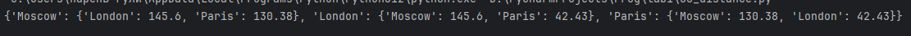

---

##  Задание 01
Нашел площадь круга, определил лежит ли точка внутри того самого круга.

###  Решение
```
radius = 42
pi=3.1415926
print("радиус - ",pi*radius**2)

point_1 = (23, 34)
print((point_1[0]**2+point_1[1]**2)**0.5<radius)

point_2 = (30, 30)
print((point_2[0]**2+point_2[1]**2)**0.5<radius)

```

### Скриншот
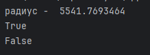

---

##  Задание 02
Расставьте знаки операций "плюс", "минус", "умножение" и скобки между числами "1 2 3 4 5" так, что бы получилось число "25".

###  Решение
```
print(((1+2)*3-4)*5)
```

### Скриншот
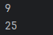

---

## Задание 03
Есть строка с перечислением фильмов: 'Терминатор, Пятый элемент, Аватар, Чужие, Назад в будущее'. 
Нужно вывести на консоль с помощью индексации строки, последовательно: первый фильм, последний, второй, второй с конца.

###  Решение
```
my_favorite_movies = 'Терминатор, Пятый элемент, Аватар, Чужие, Назад в будущее'

print(my_favorite_movies[0:10])
print(my_favorite_movies[-15:])
print(my_favorite_movies[12:25]) 
print(my_favorite_movies[-22:-17])
```
### Скриншот
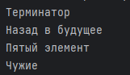

---

## Задание 04
Нужно создать список семьи и их роста, вывести рост отца и общий рост семьи.

### Решение
```
my_family = ["Брат", "Бабушка", "Сестра", "Я"]

my_family_height = [
    # ['имя', рост],
    ["Николай", 160], 
    ["Любовь", 157], 
    ["Ляна", 167], 
    ["Александр", 170]
]

print("Рост меня - " + str(my_family_height[3][1]) + " см")

total_height = my_family_height[0][1] + my_family_height[1][1] + my_family_height[2][1] + my_family_height[3][1]
print("Общий рост моей семьи -", total_height, "см")
```

### Скриншот
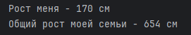

---

## Задание 05
Есть список животных в зоопарке: 'lion', 'kangaroo', 'elephant', 'monkey'. Нужно сделать:
1) Посадить медведя между львом и кенгуру;
2) Добавить птиц в зоопарк;
3) Убрать слона;
4) Узнать в какой клетке сидит лев и жаворонок.
   
### Решение
```
zoo = ['lion', 'kangaroo', 'elephant', 'monkey', ]

zoo.insert(1,"bear")
print(zoo)

birds = ['rooster', 'ostrich', 'lark', ]
zoo = zoo+birds
print(zoo)

zoo.pop(3)
print(zoo)

print("Лев сидит в клетке под номером ",zoo.index("lion")+1)
print("Жаворонок сидит в клетке под номером ", zoo.index("lark")+1)
```

### Скриншот
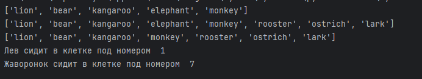

---

## Задание 06
Дан список песен группы Depeche Mode, распечатать общее время звучания трех песен: 'Halo', 'Enjoy the Silence', 'Clean' в формате "Три песни звучат ХХХ.ХХ минут", вывести общее время звучания других трёх песен: 'Sweetest Perfection', 'Policy of Truth', 'Blue Dress' в формате "А другие три звучат ХХХ минут"
### Решение
```
violator_songs_list = [
    ['World in My Eyes', 4.86],
    ['Sweetest Perfection', 4.43],
    ['Personal Jesus', 4.56],
    ['Halo', 4.9],
    ['Waiting for the Night', 6.07],
    ['Enjoy the Silence', 4.20],
    ['Policy of Truth', 4.76],
    ['Blue Dress', 4.29],
    ['Clean', 5.83],
]

time = violator_songs_list[3][1] + violator_songs_list[5][1] + violator_songs_list[-1][1]
print("Три песни звучат",round(time,3),"минут")

violator_songs_dict = {
    'World in My Eyes': 4.76,
    'Sweetest Perfection': 4.43,
    'Personal Jesus': 4.56,
    'Halo': 4.30,
    'Waiting for the Night': 6.07,
    'Enjoy the Silence': 4.6,
    'Policy of Truth': 4.88,
    'Blue Dress': 4.18,
    'Clean': 5.68,
}

time2 = violator_songs_dict['Sweetest Perfection'] + violator_songs_dict['Policy of Truth'] + violator_songs_dict['Blue Dress']
print("А другие три песни звучат ",round(time2,3),"минут")

```
### Скриншот
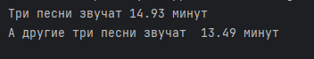

---

## Задание 07
Дано зашифрованное сообщение, необходимо его расшифровать и вывести на консоль
* Ключ к расшифровке:
первое слово - 4-я буква
второе слово - буквы с 10 по 13, включительно
третье слово - буквы с 6 по 15, включительно, через одну
четвертое слово - буквы с 8 по 13, включительно, в обратном порядке
пятое слово - буквы с 17 по 21, включительно, в обратном порядке

### Решение
```
secret_message = [
    'квевтфпп6щ3стмзалтнмаршгб5длгуча',
    'дьсеы6лц2бане4т64ь4б3ущея6втщл6б',
    'т3пплвце1н3и2кд4лы12чф1ап3бкычаь',
    'ьд5фму3ежородт9г686буиимыкучшсал',
    'бсц59мегщ2лятьаьгенедыв9фк9ехб1а',
]

print(secret_message[0][3])
print(secret_message[1][9:13])
print(secret_message[2][5:14:2])
print(secret_message[3][7:13][::-1])
print(secret_message[4][16:21][::-1])
```
### Скриншот
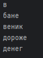

---

## Задание №9
Даны луг и сад, необходимо узнать:
1) Какие цветы растут и там, и там
2) Какие цветы растут в саду, но не растут в лугу
3) Какие цветы растут на лугу, но не растут в саду
### Решение
```
garden = ('ромашка', 'роза', 'одуванчик', 'ромашка', 'гладиолус', 'подсолнух', 'роза', )
meadow = ('клевер', 'одуванчик', 'ромашка', 'клевер', 'мак', 'одуванчик', 'ромашка', )

garden_set = set(garden)
meadow_set = set(meadow)
print(str(garden_set)+str(meadow_set))

k=garden_set&meadow_set
print(k)

print(garden_set-meadow_set)
print(meadow_set-garden_set)
```
### Скриншот
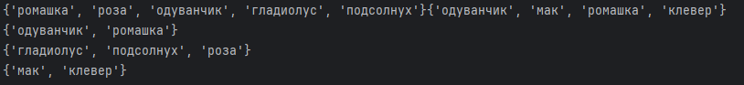

---

## Задание №10
Дан словарь магазинов с распродажами, нужно создать словарь цен на продукты следующего вида.
### Решение
```
sweets = {
    'название сладости': [
        {'shop': 'название магазина', 'price': 99.99},
        # TODO тут с клавиатуры введите магазины и цены (можно копипастить ;)
    ],
    # TODO тут с клавиатуры введите другую сладость и далее словарь магазинов
    'печенье':[{'shop':'пятёрочка', 'price':9.99},
               {'shop':'ашан', 'price':10.99},],
    
    'конфеты':[{'shop':'магнит', 'price':30.99},
               {'shop':'пятёрочка', 'price':32.99,}],
    
    'карамель':[{'shop':'магнит', 'price':41.99},
               {'shop':'ашан', 'price':45.99},],
    
    'пироженое':[{'shop':'пятёрочка', 'price':59.99,},
                 {'shop':'магнит', 'price':62.99},
            ]    
}

print(sweets)
```
### Скриншот
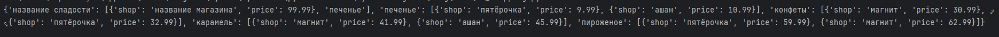

---

## Задание №11
Дан словарь кодов товаров и словарь списка количества товаров на складе, нужно рассчитать на какую сумму лежит каждого товара на складе.
### Решение
```
goods = {
    'Лампа': '12345',
    'Стол': '23456',
    'Диван': '34567',
    'Стул': '45678',
}

# Есть словарь списков количества товаров на складе.

store = {
    '12345': [
        {'quantity': 27, 'price': 42},
    ],
    '23456': [
        {'quantity': 22, 'price': 510},
        {'quantity': 32, 'price': 520},
    ],
    '34567': [
        {'quantity': 2, 'price': 1200},
        {'quantity': 1, 'price': 1150},
    ],
    '45678': [
        {'quantity': 50, 'price': 100},
        {'quantity': 12, 'price': 95},
        {'quantity': 43, 'price': 97},
    ],
}

lamps_cost = store[goods['Лампа']][0]['quantity'] * store[goods['Лампа']][0]['price']
# или проще (/сложнее ?)
lamp_code = goods['Лампа']
lamps_item = store[lamp_code][0]
lamps_quantity = lamps_item['quantity']
lamps_price = lamps_item['price']
lamps_cost = lamps_quantity * lamps_price
print('Лампа -', lamps_quantity, 'шт, стоимость', lamps_cost, 'руб')

# TODO здесь ваш код
# Стол
table_code = goods['Стол']
table_quantity_1 = store[table_code][0]['quantity']
table_price_1 = store[table_code][0]['price']
table_quantity_2 = store[table_code][1]['quantity']
table_price_2 = store[table_code][1]['price']
table_cost = (table_quantity_1 * table_price_1) + (table_quantity_2 * table_price_2)
table_quantity_total = table_quantity_1 + table_quantity_2
print('Стол -', table_quantity_total, 'шт, стоимость', table_cost, 'руб')

# Диван
sofa_code = goods['Диван']
sofa_quantity_1 = store[sofa_code][0]['quantity']
sofa_price_1 = store[sofa_code][0]['price']
sofa_quantity_2 = store[sofa_code][1]['quantity']
sofa_price_2 = store[sofa_code][1]['price']
sofa_cost = (sofa_quantity_1 * sofa_price_1) + (sofa_quantity_2 * sofa_price_2)
sofa_quantity_total = sofa_quantity_1 + sofa_quantity_2
print('Диван -', sofa_quantity_total, 'шт, стоимость', sofa_cost, 'руб')

# Стул
chair_code = goods['Стул']
chair_quantity_1 = store[chair_code][0]['quantity']
chair_price_1 = store[chair_code][0]['price']
chair_quantity_2 = store[chair_code][1]['quantity']
chair_price_2 = store[chair_code][1]['price']
chair_quantity_3 = store[chair_code][2]['quantity']
chair_price_3 = store[chair_code][2]['price']
chair_cost = (chair_quantity_1 * chair_price_1) + (chair_quantity_2 * chair_price_2) + (chair_quantity_3 * chair_price_3)
chair_quantity_total = chair_quantity_1 + chair_quantity_2 + chair_quantity_3
print('Стул -', chair_quantity_total, 'шт, стоимость', chair_cost, 'руб')
```
### Скриншот
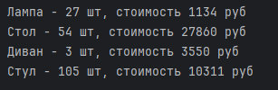

---

## Шпаргалка по работе с командами git

1. Сlone <URL репозитория> - Клонировать репозиторий на локальную машину
2. Commit — фиксирует изменения.
3. Push — отправляет изменения на сервер.
4. Pull — скачивает обновления с сервера.

## Источники

https://doka.guide/tools/markdown/ (Справка по markdown)

https://docs.python.org/3/tutorial/ (Python tutorial)

