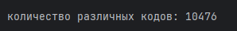
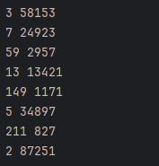

# Отчет по решению задач

## 1. Задача о кодах Тимофея

Тимофей составляет 5-буквенные коды из букв Т, И, М, О, Ф, Е, Й. Буква Й может использоваться в коде не более одного раза, при этом она не может стоять на первом месте, на последнем месте и рядом с буквой И. Все остальные буквы могут встречаться произвольное количество раз или не встречаться совсем. Сколько различных кодов может составить Тимофей?

**Решение:**

Для решения задачи была использована библиотека `itertools` для генерации комбинаций букв

**Результат:**

---

## 2. Количество единиц в двоичной записи выражения

Сколько единиц содержится в двоичной записи значения выражения:
42020 + 22017 - 15

**Результат:**

---

## 3. Делители числа
Найдите среди целых чисел, принадлежащих числовому отрезку **[174457; 174505]** числа, имеющие ровно два различных натуральных делителя, не считая единицы и самого числа. Для каждого найденного числа запишите эти два делителя в два соседних столбца на экране с новой строки в порядке возрастания произведения этих двух делителей. Делители в строке также должны следовать в порядке возрастания.

**Результат:**

