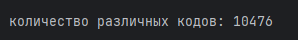
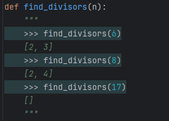
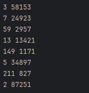

# Отчет по решению задач

## 1. Задача о кодах Тимофея


Тимофей составляет 5-буквенные коды из букв Т, И, М, О, Ф, Е, Й. Буква Й может использоваться в коде не более одного раза, при этом она не может стоять на первом месте, на последнем месте и рядом с буквой И. Все остальные буквы могут встречаться произвольное количество раз или не встречаться совсем. Сколько различных кодов может составить Тимофей?

**Решение:**

Для решения задачи была использована библиотека `itertools` для генерации комбинаций букв.
Для каждой комбинации проверяются условия:
1. Буква "Й" не должна встречаться более одного раза.
2. Буква "Й" не может быть на первом или последнем месте.
3. Буква "Й" не должна находиться рядом с буквой "И".

```python
import itertools


a = ['Т', 'И', 'М', 'О', 'Ф', 'Е', 'Й']
k = 0

for word in itertools.product(a, repeat=5):
    word = ''.join(word)

    if word.count('Й') > 1:  # Буква 'Й' не может повторяться
        continue
    if 'Й' in word:
        if word[0] == 'Й' or word[-1] == 'Й' or 'И' in word[word.index('Й') - 1:word.index('Й') + 2]:
            continue

    k += 1

print(f"\nколичество различных кодов: {k}")
```

**Результат:**



---

## 2. Количество единиц в двоичной записи выражения

Сколько единиц содержится в двоичной записи значения выражения:
4<sup>2020</sup> + 2<sup>2017</sup> - 15

**Решение:**

 Функция `bin` преобразует в двоичную СС, а `count` подсчитывает количество единиц.

```python
res = bin(4**2020 + 2**2017 - 15)

k = res.count('1')

print(f"\nКоличество единиц в двоичной записи: {k}")
```

**Результат:**


---

## 3. Делители числа
Найдите среди целых чисел, принадлежащих числовому отрезку **[174457; 174505]** числа, имеющие ровно два различных натуральных делителя, не считая единицы и самого числа. Для каждого найденного числа запишите эти два делителя в два соседних столбца на экране с новой строки в порядке возрастания произведения этих двух делителей. Делители в строке также должны следовать в порядке возрастания.


**Решение:**

Функция find_divisors(n):

Принимает число n и находит все его делители, кроме 1 и самого числа.
Возвращает список всех найденных делителей.

Также добавлен доктест для проверки правильности работы функции **find_divisors**


```python
def find_divisors(n):
    """
    >>> find_divisors(6)
    [2, 3]
    >>> find_divisors(8)
    [2, 4]
    >>> find_divisors(17)
    []
    """
    divisors = []
    for i in range(2, int(n**0.5) + 1):  # проверяем до квадратного корня
        if n % i == 0:
            divisors.append(i)
            if i != n // i:  # если i не равно n // i, добавляем оба делителя
                divisors.append(n // i)
    return divisors

if __name__ == "__main__":
    import doctest
    doctest.testmod()  # запускает все тесты из документации


for num in range(174457, 174505+1):
    divisors = find_divisors(num)
    if len(divisors) == 2:  # если два делителя
        divisors.sort()  # сортируем
        print(f"{divisors[0]} {divisors[1]}")
```

**Результат:**




---

## Список используемых источников:

[Python: doctest](https://ru.hexlet.io/courses/advanced_python/lessons/python-doctest/theory_unit)

[Python tutorial](https://docs.python.org/3/tutorial/)

[itertools в Python](https://habr.com/ru/companies/otus/articles/529356/)
