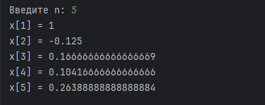

# Отчет по решению задач

## 1. Функция для подсчёта числа элементов в списках, включая вложенные списки


**Решение:**

Написал функцию count, которая:

1. Проверяется, является ли текущий элемент вложенным списком. - вызывается функция count рекурсивно и добавляет + 1
2. Если элемент не является списком, увеличивается общий счётчик.

```
def count(x):
    k = 0
    for item in x:
        if isinstance(item, list):  # Если элемент — список, вызываем функцию рекурсивно
            k += count(item) + 1
        else:
            k += 1  # Если элемент — не список, увеличиваем счётчик
    return k
```

**Результат:**



--- 

## 2. Функция для расчёта

Формула расчёта последовательности:


Где:
- x_1 = 1
- x_2 = -1/8

**Решение:**

Функция `calc`:
1. Если n является 1 или 2, то передает значения указанные в задании
2. Остальное считатется по формуле 

n вводится с клавиатуры и через цикл выводит значения функции от 1 до n

```
def calc(n):
    if n == 1:
        return 1
    if n == 2:
        return -1 / 8
    x_1 = calc(n - 1)
    x_2 = calc(n - 2)
    return ((n - 1) * x_1) / 3 + ((n - 2) * x_2) / 4

n = int(input("Введите n: "))
for i in range(1, n + 1):
    print(f"x[{i}] = {calc(i)}")
```

**Результат:**

