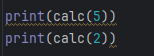
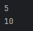

# Отчет по решению задач лабараторной работы № 4

## 1. Замыкание-калькулятор, накапливающее результат и поддерживающее 4 арифметичесике операции:

**Решение:**

Написал функцию `calc`, которая:

1. меняет начальное значение `initial`
2. выполняет арифметическую операцию, основанную на значении переменной 
3. возвращает обновленное значение `initial` после выполнения операции.

```python
def make_calc(operation, initial=0):
    def calc(value):
        nonlocal initial # меняем переменную во внешней функции
        if operation == '+':
            initial += value
        if operation == '-':
            initial -= value
        if operation == '*':
            initial *= value
        if operation == '/':
            if value != 0:
                initial /= value
            else:
                raise ValueError("нельзя делить на 0")
        return initial
    return calc

calculator = make_calc("*", initial=1)
```

**Результат:**




--- 

## 2. Декоратор, который будет запускать функцию указанное число раз с указанными параметрами и возвращать последвательность результатов.

**Решение:**

Написал декоратор `repeat`, который позволяет запускать переданную функцию несколько раз

1. `repeat(times)` — это внешняя функция, которая принимает times (сколько раз нужно выполнить функцию)


2. `decorator(func)` — это внутренняя функция, которая принимает `func`, уже которую мы будем дополнять


3. `wrapper(value)` — это третья внутренняя функция, которая фактически будет вызывать нашу функцию `func` (в данном случае calc) times раз. Все результаты выполняемой функции собираются в список `results`.


```python
def repeat(times):
    def decorator(func):
        def wrapper(value):
            results = []
            for k in range(times):
                results.append(func(value))
            return results
        return wrapper
    return decorator

@repeat(3)
def calc(value):
    return calculator(value)

print(calc(5))
print(calc(2))
```

**Результат:**


---

## Список используемых источников:

[Декораторы в python](https://sky.pro/media/chto-takoe-dekoratory-v-python/)

[Декоратор на простых примерах](https://youtu.be/OowVVZHzZMc?si=pCn30rj6444xFT35)

[Python tutorial](https://docs.python.org/3/tutorial/)

