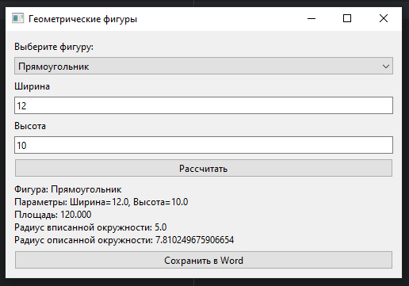
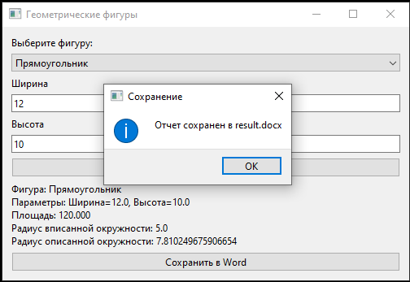
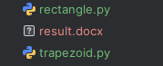
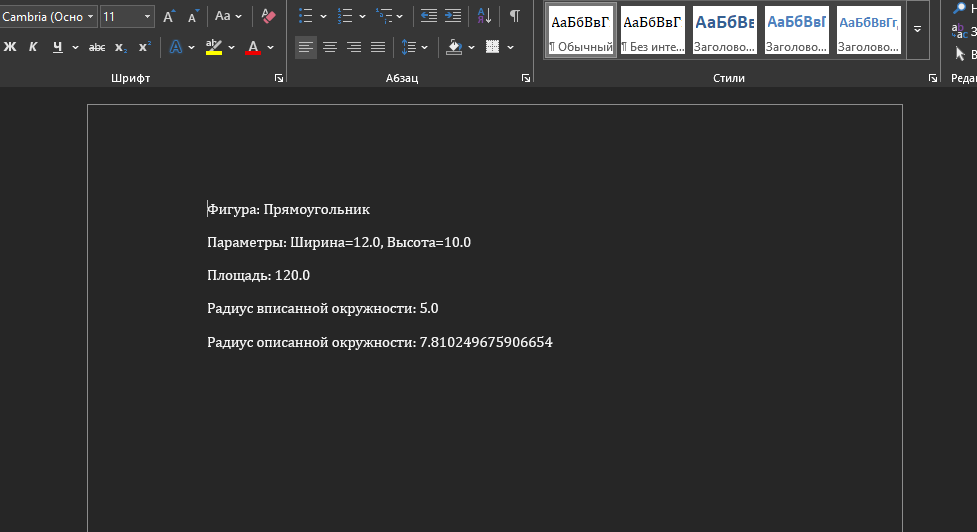

# Отчет по решению лабораторной работы №6

## 1. GUI для расчета геометрических фигур

***Решение:***

Создано приложение с графическим интерфейсом для вычисления площади, радиусов вписанной и описанной окружностей для геометрических фигур.
Программа реализована на Python с использованием библиотеки `PySide6`.
Были созданы четыре файла в каталоге geometry, три для расчета материалов, четвертый init. 
В lab6.py функции:
1. __init__: Настраивает окно приложения, вызывает создание интерфейса и инициализирует переменные.
2. init_ui: Создаёт пользовательский интерфейс с выпадающим списком, кнопками и полями ввода.
3. calculate: Выполняет расчёты площади и радиусов окружностей, выводит результат.
4. save_word: Сохраняет последний результат расчётов в файл result.docx.

**Функциональность:**

1. *Выбор фигуры.*
2. *Ввод параметров.*
3. *Вычисления.*
4. *Сохранение результатов.*


**Рассчитать:**

**Сохранить результат:**




```python
import sys
from PySide6.QtWidgets import *
from Geometry.rectangle import Rectangle
from Geometry.triangle import Triangle
from Geometry.trapezoid import Trapezoid
from docx import Document

class GeometryApp(QWidget):
    def __init__(self):
        super().__init__()
        self.setWindowTitle("Геометрические фигуры")
        self.init_ui()
        self.last_result = None

    def init_ui(self):
        self.layout = QVBoxLayout()

        self.figure_label = QLabel("Выберите фигуру:")
        self.figure_combo = QComboBox()
        self.figure_combo.addItems(["Прямоугольник", "Треугольник", "Трапеция"])
        self.figure_combo.currentIndexChanged.connect(self.update_form)

        self.param_layout = QVBoxLayout()

        self.calc_button = QPushButton("Рассчитать")
        self.calc_button.clicked.connect(self.calculate)

        self.result_label = QLabel("")

        self.save_word_button = QPushButton("Сохранить в Word")
        self.save_word_button.clicked.connect(self.save_word)

        self.layout.addWidget(self.figure_label)
        self.layout.addWidget(self.figure_combo)
        self.layout.addLayout(self.param_layout)
        self.layout.addWidget(self.calc_button)
        self.layout.addWidget(self.result_label)
        self.layout.addWidget(self.save_word_button)

        self.setLayout(self.layout)
        self.update_form()

    def clear_layout(self, layout):
        while layout.count():
            child = layout.takeAt(0)
            if child.widget():
                child.widget().deleteLater()

    def update_form(self):
        self.clear_layout(self.param_layout)
        figure = self.figure_combo.currentText()
        self.inputs = {}

        if figure == "Прямоугольник":
            for param in ["Ширина", "Высота"]:
                label = QLabel(param)
                line_edit = QLineEdit()
                self.param_layout.addWidget(label)
                self.param_layout.addWidget(line_edit)
                self.inputs[param] = line_edit

        elif figure == "Треугольник":
            for param in ["Сторона a", "Сторона b", "Сторона c"]:
                label = QLabel(param)
                line_edit = QLineEdit()
                self.param_layout.addWidget(label)
                self.param_layout.addWidget(line_edit)
                self.inputs[param] = line_edit

        else:  # Трапеция
            for param in ["Основание a", "Основание b", "Сторона c", "Сторона d", "Высота"]:
                label = QLabel(param)
                line_edit = QLineEdit()
                self.param_layout.addWidget(label)
                self.param_layout.addWidget(line_edit)
                self.inputs[param] = line_edit

    def calculate(self):
        figure = self.figure_combo.currentText()
        if figure == "Прямоугольник":
            width = float(self.inputs["Ширина"].text())
            height = float(self.inputs["Высота"].text())
            rect = Rectangle(width, height)
            area = rect.area()
            r_in = rect.inscribed_circle_radius()
            r_out = rect.circumscribed_circle_radius()
            params = f"Ширина={width}, Высота={height}"

        elif figure == "Треугольник":
            a = float(self.inputs["Сторона a"].text())
            b = float(self.inputs["Сторона b"].text())
            c = float(self.inputs["Сторона c"].text())
            tri = Triangle(a, b, c)
            area = tri.area()
            r_in = tri.inscribed_circle_radius()
            r_out = tri.circumscribed_circle_radius()
            params = f"a={a}, b={b}, c={c}"

        else:
            a = float(self.inputs["Основание a"].text())
            b = float(self.inputs["Основание b"].text())
            c = float(self.inputs["Сторона c"].text())
            d = float(self.inputs["Сторона d"].text())
            h = float(self.inputs["Высота"].text())
            trap = Trapezoid(a, b, c, d, h)
            area = trap.area()
            r_in = trap.inscribed_circle_radius()
            r_out = trap.circumscribed_circle_radius()
            params = f"a={a}, b={b}, c={c}, d={d}, h={h}"

        result_text = (
            f"Фигура: {figure}\n"
            f"Параметры: {params}\n"
            f"Площадь: {area:.3f}\n"
            f"Радиус вписанной окружности: {r_in if r_in is not None else 'Отсутствует'}\n"
            f"Радиус описанной окружности: {r_out if r_out is not None else 'Отсутствует'}"
        )
        self.last_result = {
            "Фигура": figure,
            "Параметры": params,
            "Площадь": area,
            "Радиус вписанной окружности": r_in if r_in is not None else "Отсутствует",
            "Радиус описанной окружности": r_out if r_out is not None else "Отсутствует"
        }
        self.result_label.setText(result_text)

    def save_word(self):
        path = "result.docx"
        doc = Document()
        for key, value in self.last_result.items():
            doc.add_paragraph(f"{key}: {value}")
        doc.save(path)
        QMessageBox.information(self, "Сохранение", f"Отчет сохранен в {path}")

if __name__ == "__main__":
    app = QApplication(sys.argv)
    window = GeometryApp()
    window.resize(500, 300)
    window.show()
    sys.exit(app.exec())
```

**Используемые библиотеки:**

1. PySide6 – для создания графического интерфейса
2. python-docx – для сохранения данных в формате .docx


