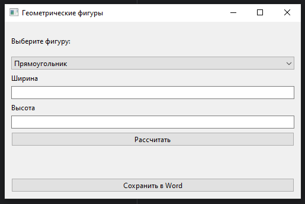

# Отчет по решению лабораторной работы №6
___

## GUI для расчета геометрических фигур

***Решение:***

Создано приложение с графическим интерфейсом для вычисления площади, радиусов вписанной и описанной окружностей для геометрических фигур.
Программа реализована на Python с использованием библиотеки `PySide6`.
Были созданы четыре файла в каталоге geometry, три для расчета материалов, четвертый init. 
В lab6.py функции:
1. __init__: Настраивает окно приложения, вызывает создание интерфейса и инициализирует переменные.
2. init_ui: Создаёт пользовательский интерфейс с выпадающим списком, кнопками и полями ввода.
3. calculate: Выполняет расчёты площади и радиусов окружностей, выводит результат.
4. save_word: Сохраняет последний результат расчётов в файл result.docx.

**Функциональность:**

1. *Выбор фигуры.*
2. *Ввод параметров.*
3. *Вычисления.*
4. *Сохранение результатов.*

**Рассчитать:**

**Сохранить результат:**

___

## Список используемых источников:

[Разработка Desktop приложений на Python и библиотека PySide6](https://habr.com/ru/articles/799037/)

[Python-docx туториал](https://docs-python.ru/packages/modul-python-docx-python/klass-document/)

[Python tutorial](https://docs.python.org/3/tutorial/)
